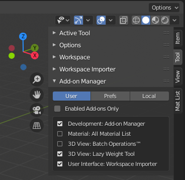

# Blender Add-on: addon_manager(experimental)
addon_managerはアドオンを手軽に管理するための実験的なBlenderアドオンです。  
サイドバーのツールタブから、アドオンの有効化/無効化を設定できます。  
Blenderの「アドオンをフィルタリング」機能から作成しました。  
元ネタ: scripts\startup\bl_ui\properties_workspace.py  
 
This is an experimental Blender Add-on. Made from 'Filter Add-ons' function of Blender.  
addon_manager can operate Add-ons enabling/disabling from Tool tab.  
Original: scripts\startup\bl_ui\properties_workspace.py  
 

 
## 導入方法_Installation
最新版ダウンロードは[こちら](https://github.com/3str6/addon_manager/releases/download/v1.0/addon_manager.zip)  
1.編集 > プリファレンス... > アドオン > インストール > ダウンロードしたaddon_manager.zipを選択します。  
2.下のリストに「Development: Add-on Manager」が表示されるのでチェックを入れて有効化します。  
3.3Dビュー > サイドバー（Nキー） > ツール タブ > Add-on Manager が追加されます。  
 
Download from [here](https://github.com/3str6/addon_manager/releases/download/v1.0/addon_manager.zip)  
1.Edit > Preference... > Add-on > Install > Select the downloaded addon_manager.zip.  
2.Enable 'Development: Add-on Manager'.  
3.View3d > Sidebar(N-key) > Tool Tab > Add-on Manager is added.  
  
## 機能一覧_Functions
本アドオンはアドオンの保存場所（ディレクトリ）毎にアドオンを表示しています。  
アドオンの保存場所は公式マニュアルから確認できます。  
今回は下記マニュアルにあるSYSTEMディレクトリには対応していません。  
https://docs.blender.org/manual/en/latest/advanced/blender_directory_layout.html  
 
This Add-on show Add-ons depending on the directories in which they are saved.  
You can see where your Add-ons are saved from Blender Manual.  
And I didn't implement the SYSTEM directory.  
https://docs.blender.org/manual/en/latest/advanced/blender_directory_layout.html
### User
  ユーザーフォルダに保存されているアドオンを表示します。  
  例：C:\Users\ユーザー名\AppData\Roaming\Blender Foundation\Blender\2.82\scripts\addons  
 
  Show Add-ons which are saved in USER Directory.  
  e.g. C:\Users\USER_NAME\AppData\Roaming\Blender Foundation\Blender\2.82\scripts\addons  
 
### Pref
  ユーザーが任意に設定したスクリプトパスに保存されているアドオンを表示します。  
  例：編集 > プリファレンス... > ファイルパス > データ > スクリプト で指定されたフォルダ  
 
  Show Add-ons which are saved in the user's scriptpath.  
  e.g. Edit > Preference... > File Paths > Data > Scripts  
 
### Local
  最初からBlenderにインストールされているアドオンを表示します。  
  例：C:\Program Files\Blender Foundation\Blender 2.82\2.82\scripts\addons  
 
  Show Add-ons which are installed in Blender.
  e.g. C:\Program Files\Blender Foundation\Blender 2.82\2.82\scripts\addons  
 
### Enabled Add-ons Only
  有効化されているアドオンのみを表示します。   
 
  Show enabled Add-ons only.  
 
## 公式の機能_Blender Functions
  本アドオンの機能はすべて公式の機能で代替できます。  
  Blenderには以下のような機能があります。  
  Blender has tha same functions as this Add-on.  
### アドオンを有効化する 
  編集 > プリファレンス... > アドオン > 対象アドオンにチェックを入れる  
 
  Enable Add-ons.  
  Edit > Preference... > Add-ons > Check the Add-on.  
 
### アドオンを無効化する
  編集 > プリファレンス... > アドオン > 対象アドオンのチェックを外す  
 
  Disable Add-ons.
  Edit > Preference... > Add-ons > Uncheck the Add-on.  
 
### アドオンをフィルタリング
  3Dビュー > サイドバー（Nキー） > ツール タブ > ワークスペース > アドオンをフィルタリング  
  フィルタリング設定は現在開いている.blendファイルの現在使用しているWorkspaceに保存されます。  
  アドオンの有効化/無効化とは異なり、.blendファイル毎の設定です。  
  Blenderの共通設定として使用したい場合は、startup.blendに設定を保存します。  
 
  Filter Add-ons  
  View3d > Sidebar(N-key) > Tool Tab > Workspace > Filter Add-ons  
 
